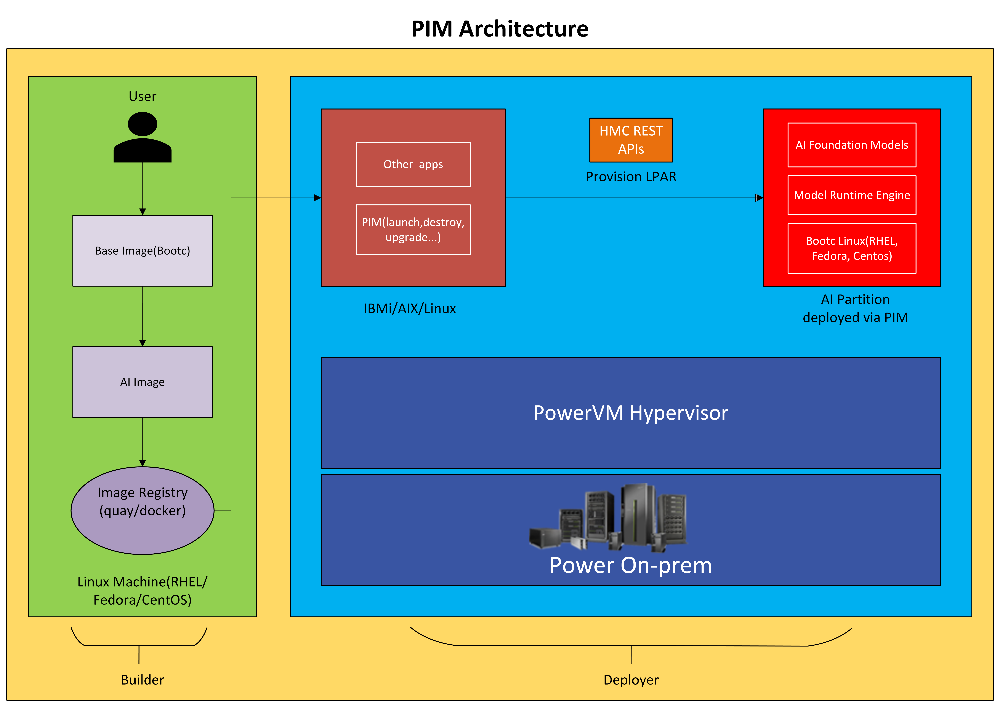

# Power Inference Microservices (PIM)

The PIM project enables the spinning up of an AI environment with very little user intervention adjacent to other workloads running on IBM Power.  These adjacent workloads might be running on any of the supported operating systems on IBM Power: IBMi, AIX or Linux as long as they are managed by a Hardware Management Console (HMC). The PIM solution leverages [bootable containers(bootc)](https://docs.fedoraproject.org/en-US/bootc/), a modern tool for deploying and configuring immutable linux systems.

PIM provides end-to-end solution for AI stack installation by logical partition creation, network and storage attachment and boots up IBM Power logical partition (LPAR) with a specified AI stack image in the configuration.



## Key highlights of PIM solution
- Seamless Update: Systems updates are automatic if a newer version of the image is publically available. Otherwise, when user upgrades via PIM [upgrade commmand](docs/deployer-guide.md#upgrade) with the latest credentials the system updates are pulled and applied from the configured private registry over a reboot of the system.
- Rollback: bootc preserves state of the system. In case of disruption in Updates, the system can be rolled back to a previous version.
- Makes admin's management simple by easing day 2 operations like monitor, upgrade and manage.
- Provides end-to-end software lifecycle management operations like [launch](docs/deployer-guide.md#launch), [destroy](docs/deployer-guide.md#destroy), [update-config](docs/deployer-guide.md#update-config), [update-compute](docs/deployer-guide.md#update-config), [rollback](docs/deployer-guide.md#rollback) and [status](docs/deployer-guide.md#status)
- Provides AI inferencing capability on CPU currently. The intent is to provide inferencing based accelerators available on the platform as and when they become available.
- PIM currently supports IBMi and Linux operating system environments. Support for deploying from AIX will be added at a later date.

## PIM Personas
PIM has 2 personas namely builder and deployer.
- **Builder:** Someone who builds a bootable AI container image to bringup the AI stack with the deployer flow. Refer [builder-guide.md](docs/builder-guide.md) for more details.
- **Deployer:** Someone who deploys a PIM solution to bring up the AI stack in IBM core environments. Refer [deployer-guide.md](docs/deployer-guide.md) for more details.

## Getting started
To get started, you can follow below steps to build and deploy a simple entity extraction application which uses vLLM.
### Builder steps
- **Step 1: Build application**
    - ***vLLM:***
        - Open source [vLLM](https://github.com/vllm-project/vllm) application can be used.
    - ***Entity Extraction App:***
        - Sample entity extraction application is provided [here](examples/simple-entity-extraction/app/entity.py) that uses OpenAI API to call `/chat/completion` API to do entity extraction.
- **Step 2: Containarize the application**
    - ***vLLM:***
        - Follow [this](examples/vllm/app/README.md) README to build the vLLM application's container image. It has a script that pulls open source vLLM code base and builds a container image.
    - ***Entity Extraction App:***
        - [README](examples/simple-entity-extraction/app/README.md) for steps to build the container image for a entity extraction application.
- **Step 3: Build Base image**
    - Follow base image building steps given [here](base-image/README.md)
- **Step 4: Build AI image**
    - ***vLLM:***
        - Follow steps given [here](examples/vllm/README.md) to build the vLLM AI image, ensure that you use the image created in `step-3` as base image(FROM).
    - ***Entity Extraction App:***
        - Scripts and README to build the AI image is given [here](examples/simple-entity-extraction/README.md), ensure that you use the vLLM AI image created in the previous step as base image(FROM) here.
### Deployer steps
- **Step 1: Setup PIM**
    - You can follow steps to setup PIM on your IBMi/Linux machine given [here](docs/deployer-guide.md#installation)
- **Step 2: Fill config.ini**
    - Read through this [guide](docs/configuration-guide.md) and fill appropriate values and use final image built on step-4 in `ai.image` field.
- **Step 3: Run Launch**
```shell
python cli/pim.py launch
```
- **Step 4: Access application**
    - Once the ```launch``` command successfully creates the partition, you should be able to access the UI for entity extraction application on port `8501` on the IP you have provided during launch in config.ini.

## Supported Versions
To successfully deploy PIM, various components of the IBM Power software stack would at the minimum have to be at the levels listed below:

| Component                                    |           P10           |             P11           |
| -------------------------------------------- | ----------------------- | ------------------------- |
| Host Management Console(HMC)                 | 1061                    | 1110                      |
| Partition Firmware(PFW)                      | 1050                    | 1110                      |
| Virtual IO Server(VIOS)                      | 4.1.1.0                 | 4.1.1.00                  |
| IBMi                                         | 7.5                     | 7.6                       |
