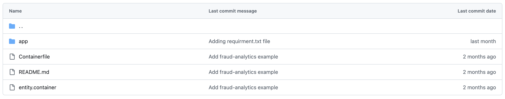

# PIM Builder guide

This guide helps to build a PIM image for AI workloads of their choice in Linux environment.
A few Inferencing AI workloads like entity extraction, fraud detection are provided for PIM provisioning as reference [here](../examples/). LLM is not mandatory for applications based on machine learning models.

## Base image
Base PIM image can be built on RHEL/Fedora/CentOS bootc image. It wraps the cloud-init tool to perform initial network/ssh configurations and basic application configurations. To decouple/ease the building of AI workloads, the base image is built separately.
This base image is constant across different AI workloads/use cases.  
Steps to build PIM image are captured [here](../base-image).

**NOTE: Builder needs to use a RHEL/CentOS/Fedora-based VM/LPAR to build the PIM base images and custom AI workload images. For the RHEL base image, the user needs to use an RHEL VM with a subscription activated. Base image for remaining OSs can be built on either CentOS or Fedora VM**

## AI image
AI image holds steps to run the AI application when it is deployed on a partition via PIM. You need to pass this AI image only to the PIM deployer utility. It usually follows below application structure to get it deployed via PIM.

- app - AI application-specific business logic and contains build scripts to build the container image of the AI application.
- entity.container - A systemd service file to pull the AI workload image(entity extraction) from a registry during runtime and run the AI application(entity extraction) as a container. Ensure all container-related inputs are added in the `Container` block.
- Containerfile - Base image should be a PIM base image. Contains copy steps to copy the entity.container and configuration scripts to run them when the system starts.

Build the PIM based AI workload image using the `podman build` command

A reference guide on building an AI workload is here [examples](../examples)
