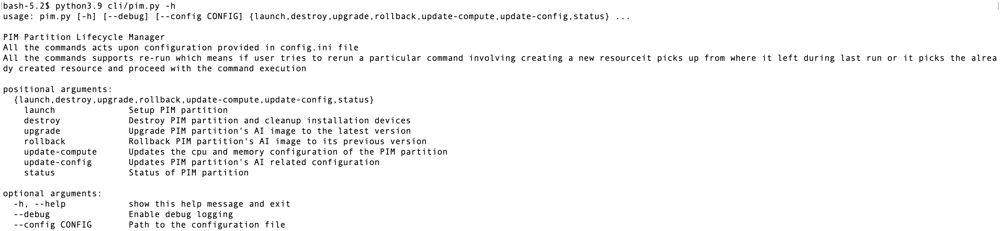

# PIM Deployer guide

PIM deployer is a user who deploys custom built PIM bootable container image composed of AI workloads like LLM inference engine or ML(Machine Learning) inference on Power environment with minimal effort.

## Setup Deployment environment

### Prerequisites
- P10 or higher power system host managed by HMC with VIOS to create partition and provision AI stack
- VIOS with an available disk size of at least 120GB (if physical disk is chosen to attach to LPAR) and media repository size of at least 2GB to host bootstrap iso and cloud-init iso
  or
- An existing partition with an external storage managed by SAN attached

### Installation
To ease installation of dependencies, installer scripts are provided in PIM.

On IBMi run
```shell
source <(curl -sL https://raw.githubusercontent.com/IBM/project-pim/main/install_ibmi.sh)
```

On Linux run
```shell
source <(curl -sL https://raw.githubusercontent.com/IBM/project-pim/main/install_linux.sh)
```
### PIM Configurations
All PIM configurations are available in config.ini. How to configure key parameters is captured in [configuration-guide](configuration-guide.md)

### Run PIM solution
python utility **pim.py** is used to perform various lifecycle operations like launch, update-config, update-compute, upgrade, rollback, status and destroy.



NOTE: 
- To run PIM in debug mode, pass `--debug` mode to above command
- To pass custom config file, set value in `--config <path of config file>`, with this if you want to do multiple AI use case deployments via PIM, different config.ini can be used.
### PIM Lifecycle management
PIM manages below listed lifecycles of partition provisioned with AI stack.  

#### Launch
- This action provisions new partition, attaches network, storage, loads bootstrap and cloud-init iso to VIOS media repositories and boots partition with AI stack.
- If deployer has a partition created with storage(SAN) attached, this flow continues to provision AI stack similar to fresh installation case.

```shell
export PYTHONPATH=.
python3 cli/pim.py launch
```

#### Upgrade
- This action upgrades the PIM AI workload image to the latest version available in the repository. If no latest image is available, it ignores upgrade.
Its important for the user to note that image credentials should be updated in config.ini if the credentials used since the launch of the partition have expired.

```shell
export PYTHONPATH=.
python3 cli/pim.py upgrade
```

#### Rollback
- This action rolls back the current PIM AI workload image to previous version of the image. 

```shell
export PYTHONPATH=.
python3 cli/pim.py rollback
```

#### Update-config
- This action updates PIM configuration(pim-config.json) like updating/changing the AI model, model related parameters(for eg: **--model** or **--max_model_len** in the case of vLLM) on an LPAR with AI stack already provisioned.
Edit below attributes to update PIM configurations


```shell
export PYTHONPATH=.
python3 cli/pim.py update-config
```

#### Update-compute
- This action updates existing PIM partition's compute like CPU, memory. CPU mode can be switched from dedicated to shared mode.
Update the cpu/memory configurations either in T-shirt sized config files(eg: [large](../cli/partition-flavor/large.ini)) or custom-config section of [config.ini](../config.ini)

```shell
export PYTHONPATH=.
python3 cli/pim.py update-compute
```

#### Status
- This action dipicts the current booted version, rollback image version of the AI workload image and their corresponding checksum values.

```shell
export PYTHONPATH=.
python3 cli/pim.py status

● Booted image: na.artifactory.swg-devops.com/sys-pcloud-docker-local/devops/pim/email-ner:latest
    Digest: sha256:693616ee36589c1223e2795858cfbee3f77ec3cb5d1fc4233952cb4572d67a6d
    Version: 9.6 (2025-06-19 06:10:07.347947545 UTC)
 Rollback image: na.artifactory.swg-devops.com/sys-pcloud-docker-local/devops/pim/email-ner:latest
     Digest: sha256:f9dddcf7220334401cf6f3447a6ff39db24bd392a1e7c3073f2e07578ecfbf61
     Version: 9.6 (2025-06-11 08:00:38.349929331 UTC)
```

#### Destroy
- This action cleans up the VIOS, storage mappings and destroys partition if the lpar is provisioned by PIM solution.

```shell
export PYTHONPATH=.
python3 cli/pim.py destroy
```
