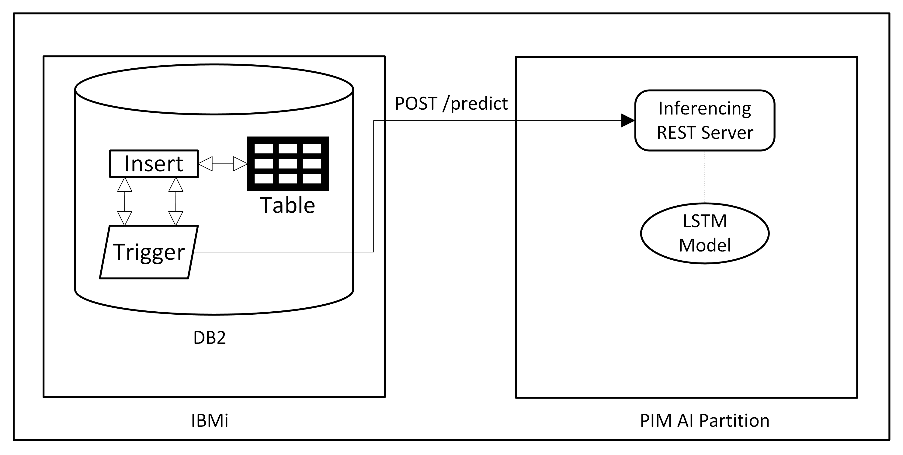

# Fraud Analytics
Fraud analytics example showcases the fraud prediction on credit card transaction happening in a DB2 table of IBMi partition.

## Architecture


## Components
### Dataset
A synthetic dataset will be used from this open source [IBM project](https://github.com/IBM/TabFormer/tree/main/data/credit_card) containing credit card transactions in a csv file.
### Model
Jupyter notebook containing the model training code is provided [here](app/train/train.ipynb). It is using tensorflow to train a LSTM model out of the dataset mentioned in above block. User needs to build the dataset and sample data to store in DB2 to try out this example.
### Inferencing application
Python flask API server serves an endpoint to predict given credit card transaction is fraud or not, is located [here](app/linux_inference_endpoint.py). User needs to build a PIM stack around it and deploy it into a partition to serve the inferencing requests. User also should supply the model files generated in above section for inferencing.
### DB2 
Sample data generated during model training via jupyter notebook will be used to load into DB2 table via scripts provided [here](app/sql/). A trigger will be created to call the above inference API to predict the new transactions that are getting added into the table are fraud or not.

## Steps to setup e2e flow
### Step 1: Building the images
Considering you have already cloned and your current working directory is `examples/fraud-analytics`

**Building fraud analytics bootc image:**
```shell
podman build -t <your registry>/pim:fraud-analytics
```
**Building inference application image:**

Building application image involves building components like tensorflow and other many required components from scratch which requires a minimum memory of 192GB & disk size of 120GB. So please make sure you have enough memory & disk capacity in the machine wherever you are building this image.
```shell
cd app
podman build -t build -t <your registry>/pim:fraud-analytics-app .
```

### Step 2: Training the model
Model can be trained by running the jupyter notebook provided [here](app/train/train.ipynb). Both inference application and model training jupyter notebook share the same set of dependencies hence you can utilise inference application image built above to run the jupyter notebook to train your model and generate sample data to load into your DB2 table.
```shell
podman run /opt/artifacts:/opt/artifacts -p 8888:8888 -d localhost/fraud-analytics-app /opt/venv/bin/jupyter lab --no-browser --ip=0.0.0.0 --allow-root --port=8888 --NotebookApp.token='' --NotebookApp.allow_origin='*'
```
This will start a container that listens on port 8888 which is forwarded to your current machine, so you can access the jupyter notebook via `<current machine's IP address or host>:8888`. Since we have mounted `/opt/artifacts` dir, the generated artifacts upon training the model will be available here. It will contain model files(.h5 & .pkl files) and sample data in csv. You need to pass these model files as an input to your AI partition for inferencing, it is explained in detail in next section.

### Step 3: Setting up PIM partition
Follow this [deployer section](../../README.md#deployer-steps) to setup PIM cli, configuring your AI partition and launching it.
Regarding configuration of fraud analytics application user need to provide generated model artifacts like model & mapper to the PIM partition like below in `ai.config-json` section.
```ini
  config-json = """
  {
     "mapper": "http://9.114.99.231/fraud_artifacts/fitted_mapper.pkl",
     "model": "http://9.114.99.231/fraud_artifacts/model.h5"
  }
```
Both these model files will be available in `/opt/artifacts` dir on the machine where you have run the jupyter notebook. Store these files in a simple HTTP server and pass it to the PIM partition like above.
```shell
# Install httpd
yum install httpd -y
systemctl enable httpd
systemctl start httpd

# Move artifacts
mv /opt/artifacts/* /var/www/html/fraud_artifacts
```

### Step 4: Setup DB2
You can use your preferred mode of executing SQL queries in your IBMi partition. e.g. IBMi ACS tool -> Database -> Run SQL Scripts

**Step I:**
- Create table in IBMi DB2 - [create_table.sql](app/sql/create_table.sql)

**Step II:**
- Load data into table - [insert_data.sql](app/sql/insert_data.sql). Ensure to replace the csv file path to the appropriate path where you are keeping the `/opt/artifacts/data_to_insert.csv`

**Step III:**
- Create GET function - [get_transactions.sql](app/sql/get_transactions.sql)
- Create Trigger - [insert_trigger.sql](app/sql/insert_trigger.sql). Ensure to replace the IP of inference endpoint(PIM AI partition's IP) in SQL query to make `POST /predict` call.

**Step IV:**
Insert a new record to test the prediction
```
insert into PIM.INDEXED_TR(INDEX,USER_ID,CARD,YEAR,MONTH,DAY,TIME,AMOUNT,USE_CHIP,MERCHANT_NAME,MERCHANT_CITY,MERCHANT_STATE,ZIP,MCC,IS_ERRORS,IS_FRAUD) values (100526,29,3,2019,2,20,'12:38','$44.41','Swipe Transaction','-34551508091458520','La Verne','CA',91750,5912,'','No')
```
This is a sample for fraudulent transaction, hence even though we try to add `IS_FRAUD` as `No`, ML will predict this as fraudulent transaction and inserts `IS_FRAUD` as `Yes`
