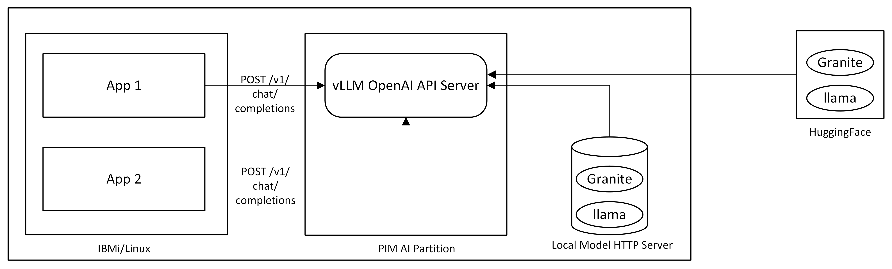

# vLLM

vLLM example allows you to deploy vLLM inference engine that exposes OpenAI API server on a partition which allows you to leverage the GenAI capabilities on your on prem environment.

## Architecture


## Steps to setup e2e flow

### Step 1: Preparing the images

#### Use Pre-built images
##### Application Image
- Container image that can run vLLM's OpenAI API server 
- Recommended to use the vLLM application image built by IBM Linux on Power team. Image details are updated over a blog post [here](https://community.ibm.com/community/user/blogs/priya-seth/2023/04/05/open-source-containers-for-power-in-icr)
```
icr.io/ppc64le-oss/vllm-ppc64le:0.10.1.dev852.gee01645db.d20250827
```
##### PIM Bootc Image
- Bootc image to bringup the AI partition that can run the above vLLM application container.
- Recommended to use the pre-built PIM Bootc image and its available to consume directly via below image.
```
quay.io/powercloud/pim:vllm
``` 

#### Build from source
If you wish to build your own version, you can follow below steps to build it.

##### Step 1: Build Application image

Follow the instructions in the [README](app) to build the vLLM application's container image. It has a script that pulls open-source vLLM code base and builds a container image.

##### Step 2: Build PIM Base image

Follow the steps provided [here](../../base-image) to build the base image or use the pre-built base-image `quay.io/powercloud/pim:base`

##### Step 3: Build PIM Bootc image

Ensure to replace the `FROM` image in [Containerfile](Containerfile) with the base image you have built before building this image.

```shell
podman build -t <your registry>/pim:vllm

podman push <your registry>/pim:vllm
```

### Step 2: Setting up PIM partition

Follow this [deployer guide](../../docs/deployer-guide.md) to setup PIM cli, configuring your AI partition and launching it.
Regarding the configuration of your vLLM application, below configs are supported. Please read through them and use them as per your requirement in config file detailed in deployer guide.

#### llmImage
- Use `llmImage` param to pass the vLLM application's container image to be used in your AI partition. 
- Look at the image section [here](#step-1-preparing-the-images) to decide the image to be used.
- This is given as a configurable option so that in future if there is a newer version of vLLM image available, we can just update the stack via [update-config](../../docs/deployer-guide.md#update-config)
#### llmArgs
- Arguments you want to pass it to your vLLM inference engine
#### llmEnv
- Environment variables that you want to set while running vLLM inference engine
#### modelSource
- A JSON object that specifies the source from which you want to download the model. 
- Use this parameter to use a offline model loaded within the local network instead of downloading from hugging face over the internet. This is suitable for environment which restricts outside connection. 
- Follow the steps [here](local-model-server.md) to bring up self-hosted HTTP server which serves the offline models.

**Sample config:**
```ini
config-json = """
  {
        "llmImage": "icr.io/ppc64le-oss/vllm-ppc64le:0.10.1.dev852.gee01645db.d20250827",
        "llmArgs": "--model ibm-granite/granite-3.3-8b-instruct --max-model-len=8192 --max-num-batched-tokens=8192",
        "llmEnv": "OMP_NUM_THREADS=16,VLLM_CPU_OMP_THREADS_BIND=all",
        "modelSource": { "url": "http://<Host/ip>/models--ibm-granite--granite-3.2-8b-instruct.tar.gz" }
  }
  """
```
